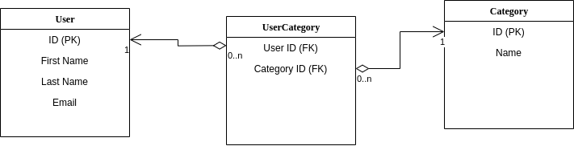
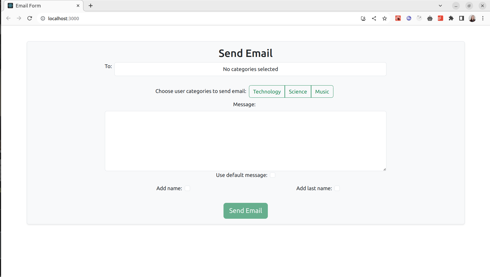
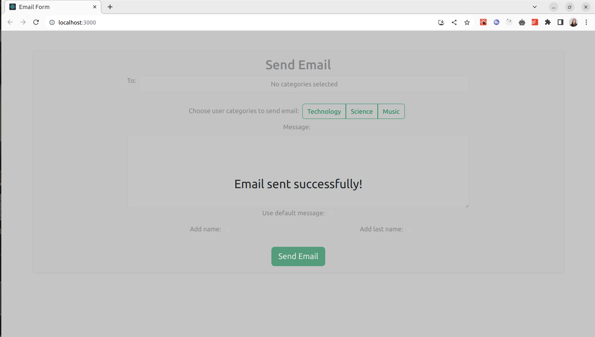

# Zadanie

## Skrypt PHP do wysyłania wiadomości e-mail z kategoriami

Prosimy o stworzenie skryptu PHP, który umożliwia wysyłanie wiadomości e-mail do użytkowników zgrupowanych według określonych kategorii. Należy przyjąć poniższe założenia:

- Dane użytkowników przechowywane są w bazie danych - zaproponuj jej strukturę.
- Użytkownicy mogą być przypisani do kilku predefiniowanych kategorii jednocześnie.
- Skrypt umożliwia wybór kategorii oraz przekazanie treści wiadomości.
- Treść wiadomości może być bezpośrednio zakodowana w skrypcie lub opcjonalnie być wprowadzona przez użytkownika za pomocą formularza.
- Skrypt umożliwia dodanie zmiennych do treści wiadomości, takich jak imię i nazwisko użytkownika, które są pobierane z bazy danych.

Zadanie możesz samodzielnie uszczegółowić, trzymając się ram podanych powyżej.

### Proponowana struktura bazy danych

*Należy utwórzyć bazę danych o nazwie user_category_db i uruchomić komendę SQL z pliku db.sql

**Nie użyto żadnej integracji serwera SMTP

### Strona główna

### Wysłanie wiadomości email

Po wybraniu kategorii użytkowników(jednej lub więcej) do których będzie wysłana wiadmość, należy wpisać treść wiadomości lub wybrać opcje domyślnej wiadmości. Także można dodać imię lub nazwisko użytkownika.

Po naciśnięciu przycisku wysłania jest widoczny ekran ładowania, a także komunikat odnoszący się do ostatecznego statusu wysłania("success/error").

### Wykorzystane technologie

- PHP (backend)
- Mysql (database)
- React JS (frontend)
- Bootstrap (styling)
